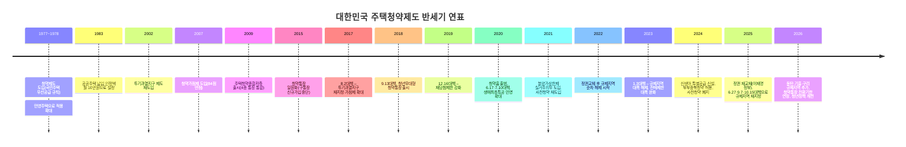
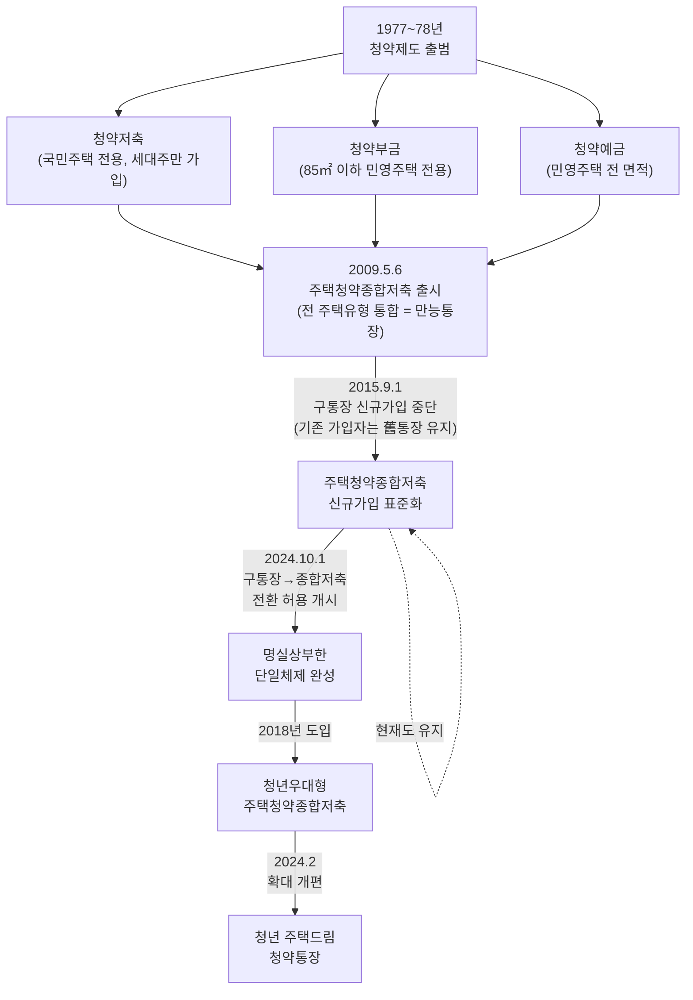
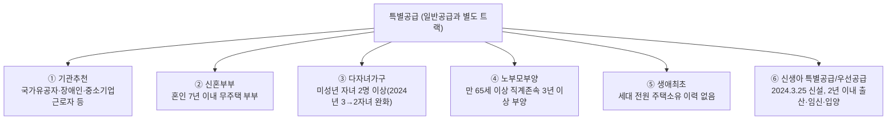
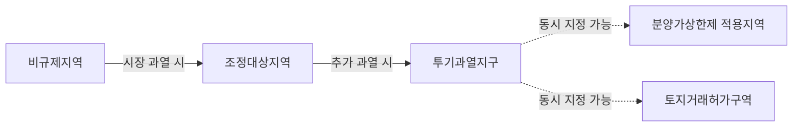
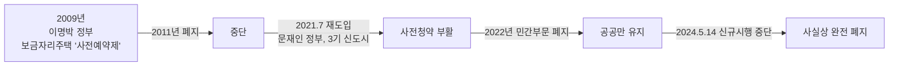
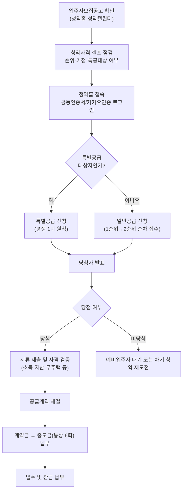
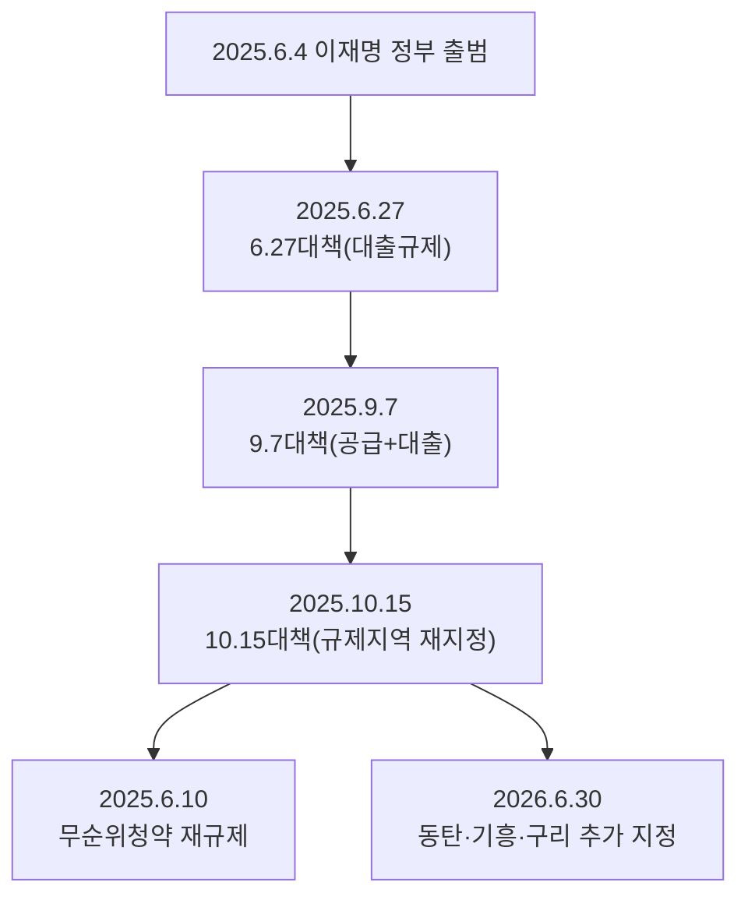

# 대한민국 주택청약제도에 관하

> **기준일: 2026년 7월 19일**
> 이 문서는 1977년 제도 도입부터 2026년 현재까지의 주택청약제도 전반과 시기별 법령 개정 내용을 정리한 자료입니다. 청약 관련 규정은 정부 정책에 따라 매우 자주 개정되므로, 실제 청약 신청 전에는 반드시 **청약홈(applyhome.co.kr)**의 해당 단지 **입주자모집공고문**과 국토교통부 발표 자료로 최종 확인하시기 바랍니다. 본 문서는 정보 제공을 목적으로 하며 법률·재정 자문이 아닙니다.

---

## 목차

1. [청약제도 개요](#1부-청약제도-개요)
2. [청약제도 반세기 역사 한눈에 보기](#2부-청약제도-반세기-역사-한눈에-보기)
3. [청약통장 완벽정리](#3부-청약통장-완벽정리)
4. [청약 순위와 자격요건](#4부-청약-순위와-자격요건)
5. [청약가점제 완벽분석](#5부-청약가점제-완벽분석)
6. [특별공급 완벽정리](#6부-특별공급-완벽정리)
7. [규제지역과 청약규제](#7부-규제지역과-청약규제)
8. [전매제한·재당첨제한·실거주의무](#8부-전매제한-재당첨제한-실거주의무)
9. [무순위 청약("줍줍")](#9부-무순위-청약줍줍)
10. [사전청약제도: 도입과 폐지](#10부-사전청약제도-도입과-폐지)
11. [청약 신청 절차](#11부-청약-신청-절차)
12. [시기별 법령 개정 총정리](#12부-시기별-법령-개정-총정리)
13. [2025~2026년 최신 동향](#13부-2025-2026년-최신-동향)
14. [마무리: 체크리스트와 참고자료](#14부-마무리-체크리스트와-참고자료)

---

## 1부. 청약제도 개요

### 1.1 주택청약제도란?

주택청약제도는 신축 주택(아파트)을 분양받고자 하는 사람이 정해진 절차와 자격기준에 따라 우선순위를 부여받아 공급받도록 하는 대한민국 고유의 주택 공급 시스템입니다. 한정된 물량의 새 아파트를 무주택 실수요자에게 우선 배분하고, 투기 수요를 억제하기 위해 1977년 도입된 이후 지금까지 운영되고 있습니다.

**제도의 핵심 목적**
- 무주택 서민의 내 집 마련 기회 보장
- 실수요자 우선 공급을 통한 투기적 수요 차단
- 신혼부부·다자녀·고령부모 부양 가구 등 정책적 배려가 필요한 계층 지원
- 선착순이 아닌 저축(청약통장)을 매개로 한 공정한 순번 관리

### 1.2 운영 체계

| 기관 | 역할 |
|---|---|
| **국토교통부** | 청약 관련 법령(주택법, 주택공급에 관한 규칙) 제·개정, 정책 총괄 |
| **한국부동산원** | 청약홈(applyhome.co.kr) 운영, 청약 접수·당첨자 관리 |
| **주택도시보증공사(HUG)** | 주택도시기금 운용, 청약통장(주택청약종합저축) 관리 감독 |
| **시중은행(9개 은행)** | 국민·신한·우리·하나·기업·농협·수협·대구·부산은행 등에서 청약통장 판매·관리 |
| **지방자치단체** | 조정대상지역 등 규제지역 심의 참여, 무순위 청약 거주요건 결정 등 |

### 1.3 국민주택 vs 민영주택

청약제도를 이해하는 첫걸음은 공급 주체에 따른 주택 구분입니다.

| 구분 | 국민주택 | 민영주택 |
|---|---|---|
| 공급 주체 | 국가·지자체·LH·지방공사 등이 국민(국가)의 재정이나 주택도시기금 지원을 받아 건설 | 민간 건설사가 자체 자금으로 건설 |
| 규모 | 전용면적 85㎡ 이하(수도권·도시지역 외 읍·면은 100㎡ 이하) | 제한 없음 |
| 당첨자 선정(1순위 경쟁 시) | **납입 총액**이 많은 순 (저축액 순차제) | **가점제·추첨제** 병행 |
| 대표 브랜드 | 뉴:홈(공공분양), 행복주택, LH·SH 분양단지 등 | 일반 민간 아파트 브랜드 전체 |

> 과거에는 청약통장 종류(청약저축=국민주택용, 청약예금·부금=민영주택용)에 따라 신청 가능한 주택유형이 갈렸지만, 2009년 주택청약종합저축 출시 이후에는 **통장 하나로 국민주택·민영주택 모두 청약이 가능**합니다.

---

## 2부. 청약제도 반세기 역사 한눈에 보기

### 2.1 전체 흐름 타임라인

### 2.2 시대별 개관

주택청약제도 47년사(1977~2026)는 대체로 5개의 국면으로 나눌 수 있습니다. 아래 구분은 이해를 돕기 위한 편의상 구분이며, 실제로는 정권과 무관하게 시장 상황에 따라 규제·완화가 반복되어 왔습니다.

| 시기 | 국면 | 주요 특징 |
|---|---|---|
| 1977~2001 | **제도 도입·정착기** | 청약저축·부금·예금 체계 확립, 순차제 중심 |
| 2002~2013 | **투기 대응 1기** | 투기과열지구 재도입, 전매제한·재당첨제한 신설·강화 |
| 2014~2016 | **1차 완화기** | 9.1대책으로 1순위 요건 완화(2년→1년), 청약통장 일원화 |
| 2017~2021 | **재규제기** | 8.2·9.13·6.17·7.10대책 등 연쇄 규제 강화, 가점제 비중 확대 |
| 2022~2024 | **2차 완화기** | 정권교체 후 규제지역 대거 해제, 전매제한 완화, 저출산 대응 특공 신설 |
| 2025~현재 | **재규제기** | 집값 재급등에 따라 서울 전역·경기 12곳 이상 규제지역 재지정 |

이처럼 한국의 청약·부동산 규제는 **"과열 → 규제 강화 → 시장 냉각 → 규제 완화 → 재과열"**의 순환 구조를 반복해 왔다는 점이 특징입니다. 아래 각 부에서 항목별로 상세히 다룹니다.

---

## 3부. 청약통장 완벽정리

### 3.1 청약통장 계보도

### 3.2 청약통장 종류 비교표 (역사적 변화 포함)

| 통장 종류 | 운영 기간 | 청약 대상 | 가입 대상 | 현재 상태 |
|---|---|---|---|---|
| 청약저축 | 1977~2015.9.1(신규가입 중단) | 국민주택(85㎡ 이하) | 무주택 세대주 | 신규가입 불가. 기존 가입자는 유지 또는 종합저축 전환 가능 |
| 청약부금 | ~2015.9.1(신규가입 중단) | 85㎡ 이하 민영주택 | 20세 이상 개인 | 신규가입 불가. 전환 가능 |
| 청약예금 | ~2015.9.1(신규가입 중단) | 민영주택(전 면적) | 20세 이상 개인 | 신규가입 불가. 전환 가능 |
| **주택청약종합저축** | 2009.5.6~현재 | 국민주택+민영주택 전체(만능통장) | 국내 거주 개인(연령 제한 없음, 1인 1계좌) | **현재 표준 상품** |
| 청년우대형 주택청약종합저축 | 2018~2024.2(청년주택드림으로 전환) | 상동 | 만 19~34세, 무주택, 소득 3,600만원 이하 | 청년주택드림청약통장으로 자동 전환 완료 |
| **청년 주택드림 청약통장** | 2024.2~현재 | 상동 | 만 19~34세, 무주택, 연소득 5,000만원 이하 | **현재 청년 대상 표준 상품** |

> ⚠️ **전환 제도의 정확한 타임라인**: 2015.9.1 조치는 구통장의 **신규가입만 중단**시켰을 뿐, 기존 가입자가 종합저축으로 갈아탈 수 있는 길은 없었습니다. 그러다 **2024년 10월 1일부터** 구(舊) 청약저축·청약예금·청약부금 가입자가 주택청약종합저축으로 **전환할 수 있는 제도가 처음 시행**되었고, 이 한시적 전환 시한이 현재 **2026년 9월 30일까지** 연장되어 있습니다. 전환 시 기존 납입 횟수·금액·가입기간(순위기산일)은 그대로 인정됩니다.

### 3.3 주택청약종합저축 상세 (2026년 7월 기준)

| 항목 | 내용 |
|---|---|
| 가입 대상 | 국내 거주 국민인 개인 또는 외국인 거주자(재외국민·외국국적동포 포함), 연령·자격 제한 없음(1인 1계좌) |
| 납입 방식 | 매월 2만원 이상 50만원 이하 자유적립식(일시예치도 가능) |
| 월납입 인정액 | **25만원**(2024.11.1부터 상향, 종전 10만원 — 1983년 이후 41년 만의 개정) |
| 소득공제 | 총급여 7,000만원 이하 무주택 세대주(2025년부터 배우자까지 확대 예정 발표)가 연납입액 300만원 한도 내 40% 공제(최대 120만원) |
| 미성년자 납입 인정기간 | 최대 5년(60회차)까지 인정 — 2024.1.1 이후 납입분부터 적용(종전 2년/24회차) |
| 예금자 보호 | 예금자보호법 적용 대상은 아니지만, 주택도시기금 재원으로 정부(국토교통부)가 직접 관리 |

### 3.4 청년 주택드림 청약통장

2024년 2월 출시된 **청년 주택드림 청약통장**은 기존 청년우대형 주택청약종합저축을 확대 개편한 상품으로, 저축부터 청약·주택구입자금 대출까지 연계 지원하는 것이 특징입니다.

| 항목 | 청년우대형(구) | 청년 주택드림(신, 2024.2~) |
|---|---|---|
| 소득 기준 | 연 3,600만원 이하 | 연 **5,000만원** 이하로 완화 |
| 최대 금리 | 4.3% | **4.5%**로 인상 |
| 월 납입 한도 | 50만원 | **100만원**으로 확대 |
| 연계 대출 | 없음 | 청약 당첨 시 분양가 80%까지 **연 2%대** 청년 주택드림 대출 연계 |
| 대출 우대금리 | - | 결혼 시 0.1%p, 출산 시 0.5%p, 추가 출산 시 1명당 0.2%p 추가 인하 |

기존 청년우대형 가입자는 별도 신청 없이 자동으로 청년 주택드림 청약통장으로 전환되며, 납입 기간·금액·회차가 그대로 인정됩니다.

### 3.5 청약통장 금리 변동의 역사

주택청약종합저축은 변동금리 상품으로, 국토교통부 장관 고시로 금리가 조정됩니다(2013년부터는 고시 방식으로 전환되어 조정 기간이 20일 이내로 단축).

| 시행일 | 1개월~1년 미만 | 1~2년 미만 | 2년 이상 | 비고 |
|---|---|---|---|---|
| 2009.5.6(출시) | 2.5% | 3.5% | 4.5% | 당시 시중 적금금리(3~4%)보다 높아 재테크 상품으로 주목 |
| 2012.12.21 | 2.0% | 3.0% | 4.0% | |
| 2013.7.22 | 2.0% | 2.5% | 3.3% | 국토부 고시 방식 전환 |
| 2014.10.1 | 2.0% | 2.5% | 3.0% | |
| 2015.3.1 | 1.8% | 2.3% | 2.8% | |
| 2015.6.22 | 1.5% | 2.0% | 2.5% | |
| 2022.11.23 | 1.3% | 1.8% | 2.1% | 기준금리 인상기 저점 |
| 2023년경 | 2.0% | 2.5% | 2.8% | 해지 증가에 따른 인상 |
| **2024.9.23~현재** | **2.3%** | **2.8%** | **3.1%** | 0.3%p 추가 인상, 월납입인정액도 25만원으로 동시 확대 |

> **청년 주택드림 청약통장 금리(2026.3.18 기준)**: 1개월 초과~1년 미만 3.7%, 1~2년 미만 4.2%, **2~10년 4.5%**, 10년 초과분 3.1%로 일반 통장보다 높은 우대금리가 적용됩니다.

---

## 4부. 청약 순위와 자격요건

### 4.1 1순위·2순위 결정 기준

청약통장 가입 후 일정 조건을 충족하면 1순위, 그렇지 못하면 2순위 자격이 부여됩니다. 지역의 규제 수준에 따라 요구되는 가입 기간이 다릅니다.

| 지역 구분 | 통장 가입기간(1순위) | 납입 횟수(국민주택) | 세대주 요건 |
|---|---|---|---|
| 투기과열지구·청약과열지역(조정대상지역) | **가입 후 2년 경과** | 24회 이상 | 세대주만 가능(세대원 중 과거 5년 내 당첨자 없어야 함) |
| 위축지역 | 가입 후 1개월 경과 | 1회 이상 | 제한 없음 |
| 수도권 內 그 외 지역 | 가입 후 1년 경과(시·도지사가 24개월 내에서 조정 가능) | 12회 이상 | 제한 없음(단, 국민주택은 세대주 우선) |
| 비수도권 | 가입 후 6개월~1년 경과(지역별 상이) | 6회 이상 | 제한 없음 |

- 민영주택은 지역별·면적별 **예치기준금액**(예: 서울 85㎡ 이하 300만원 등)을 채워야 1순위 청약이 가능합니다.
- 2순위는 1순위에 해당하지 않는 청약통장 가입자 전체이며, 청약통장 가입 사실 자체가 있으면 신청할 수 있습니다(단, 조정대상지역 2순위는 청약통장 보유자만 가능하도록 강화된 바 있습니다).

### 4.2 1순위 요건의 변천사

| 시점 | 수도권 1순위 요건 | 배경 |
|---|---|---|
| ~2014.8 | 가입 후 **2년** 경과 | 원칙적 기준 |
| 2014.9.1(9.1대책) | 가입 후 **1년**으로 완화 | 침체된 부동산 시장 정상화 목적(박근혜 정부) |
| 2017.8.2(8.2대책) | 조정대상지역·투기과열지구는 다시 **2년**으로 강화 | 과열 재현에 따른 재규제(문재인 정부) |
| 2026년 현재 | 규제지역은 2년, 비규제지역은 1년(지자체 재량 조정 가능) | 규제지역 지정 여부에 연동 |

### 4.3 세대주·무주택 요건

- **국민주택**은 원칙적으로 **무주택 세대주**만 청약 가능(1세대 1주택 기준이 아니라 세대 구성원 전원 무주택 요건).
- **민영주택**은 세대주가 아니어도, 유주택자라도 청약통장 요건만 갖추면 일반공급 신청이 가능합니다(단, 특별공급은 대부분 무주택 요건 필수).
- 세대에 속한 모든 구성원이 과거 주택을 소유한 사실이 없어야 "생애최초"로 인정되는 등, 특별공급 유형별로 무주택 기준의 판단 범위가 다르므로 유의해야 합니다.

---

## 5부. 청약가점제 완벽분석

### 5.1 가점제 도입 배경

2007년 9월, 노무현 정부는 「주택공급에 관한 규칙」을 개정하여 **청약가점제**를 도입했습니다. 그 전까지는 청약통장 가입 기간이 길수록, 그리고 추첨을 통해 당첨자가 결정되는 방식이었으나, 무주택 기간이 길고 부양가족이 많은 실수요자에게 더 많은 기회를 주기 위해 점수제로 전환한 것입니다. 민영주택 일반공급에서 동일 순위 내 경쟁이 있을 때 적용되며, 총 **84점 만점**입니다.

### 5.2 청약가점제 84점 배점표

**① 무주택기간 (최대 32점)** — 청약통장 가입자 본인(만 30세 기산, 30세 이전 혼인 시 혼인신고일 기산) 및 배우자 기준

| 무주택기간 | 점수 | 무주택기간 | 점수 |
|---|---|---|---|
| 1년 미만 | 2점 | 8~9년 미만 | 18점 |
| 1~2년 미만 | 4점 | 9~10년 미만 | 20점 |
| 2~3년 미만 | 6점 | 10~11년 미만 | 22점 |
| 3~4년 미만 | 8점 | 11~12년 미만 | 24점 |
| 4~5년 미만 | 10점 | 12~13년 미만 | 26점 |
| 5~6년 미만 | 12점 | 13~14년 미만 | 28점 |
| 6~7년 미만 | 14점 | 14~15년 미만 | 30점 |
| 7~8년 미만 | 16점 | **15년 이상** | **32점** |

**② 부양가족 수 (최대 35점)** — 청약자 본인 제외, 주민등록등본상 등재된 배우자·직계존속·미혼 직계비속 기준

| 부양가족 수 | 점수 |
|---|---|
| 0명 (본인 단독) | 5점 |
| 1명 | 10점 |
| 2명 | 15점 |
| 3명 | 20점 |
| 4명 | 25점 |
| 5명 | 30점 |
| **6명 이상** | **35점** |

**③ 청약통장 가입기간 (최대 17점)**

| 가입기간 | 점수 | 가입기간 | 점수 |
|---|---|---|---|
| 6개월 미만 | 1점 | 8~9년 미만 | 10점 |
| 6개월~1년 미만 | 2점 | 9~10년 미만 | 11점 |
| 1~2년 미만 | 3점 | 10~11년 미만 | 12점 |
| 2~3년 미만 | 4점 | 11~12년 미만 | 13점 |
| 3~4년 미만 | 5점 | 12~13년 미만 | 14점 |
| 4~5년 미만 | 6점 | 13~14년 미만 | 15점 |
| 5~6년 미만 | 7점 | 14~15년 미만 | 16점 |
| 6~7년 미만 | 8점 | **15년 이상** | **17점** |
| 7~8년 미만 | 9점 | | |

> 💡 **이론상 만점(84점)을 받으려면** 무주택 기간 15년 이상 + 청약통장 가입 15년 이상 + 부양가족 6명 이상이 모두 충족되어야 합니다. 제도 시행 18년이 지난 2026년 현재, 수도권 인기 단지의 실제 당첨 커트라인 가점이 만점에 근접하는 경우가 많아 "청약통장 무용론"이 제기될 정도로 경쟁이 치열합니다.

### 5.3 가점제 vs 추첨제 적용 비율

민영주택 일반공급 물량은 지역 규제 수준과 전용면적에 따라 가점제·추첨제 비율이 다르게 적용됩니다. 2022년 말~2023년 초 개편으로 청년·신혼 등 상대적으로 가점이 낮은 계층의 당첨 기회를 넓히는 방향으로 추첨제 비중이 확대되었습니다.

| 지역 구분 | 전용 60㎡ 이하 | 전용 60㎡ 초과~85㎡ 이하 | 전용 85㎡ 초과 |
|---|---|---|---|
| **투기과열지구** | 가점 40% · 추첨 60% | 가점 70% · 추첨 30% | 가점 80% · 추첨 20% |
| **조정대상지역** | 가점 40% · 추첨 60% | 가점 70% · 추첨 30% | 가점 50% · 추첨 50% |
| 비규제지역(수도권·광역시) | 40% 이하 범위에서 지자체장 결정 · 나머지 추첨 | 좌동 | **가점 0% · 추첨 100%** |

> ※ 위 비율은 2023년 4월 시행된 개편 기준입니다. 투기과열지구 85㎡ 초과분은 2017년 8.2대책 당시 "가점 50%·추첨 50%"였으나, 2022~2023년 개편으로 중장년 선호가 높은 대형 평형은 가점제를 오히려 확대(80%)하고, 청년 선호가 높은 중소형(60㎡ 이하)은 추첨제를 대폭 확대(60%)하는 방향으로 조정되었습니다. **정확한 최신 비율은 청약홈 공고문에서 반드시 재확인하세요.**

### 5.4 가점제 관련 최근 제도 변경 (2024년 3월 개편)

| 변경 내용 | 개편 전 | 개편 후(2024.3.25~) |
|---|---|---|
| 배우자 청약통장 합산 | 본인 가입기간만 인정 | **배우자 가입기간 합산 인정**(최대 17점, 순위확인서 필요) |
| 동일 날짜 부부 중복청약 | 부부가 각각 신청해 동시 당첨되면 **둘 다 무효** | **먼저 접수한 건만 유효** 처리(청약 기회 사실상 2회로 확대) |
| 가점제 동점자 처리 | 청약통장 가입기간이 긴 사람 우선 | 2024년 개선으로 명확화(가입기간 우선 원칙 확정) |
| 미성년자 가입 인정기간 | 최대 2년(24회) | **최대 5년(60회)**로 확대 |

> 📌 청약가점제의 동점자 처리 방식을 아예 "추첨제로 전환"하는 추가 개편이 일부 매체에서 언급되고 있으나, 2026년 7월 기준으로 이는 **아직 확정되지 않은 논의 단계**입니다. 실제 시행 여부와 시기는 국토교통부 공식 발표를 통해 확인해야 합니다.

---

## 6부. 특별공급 완벽정리

### 6.1 특별공급이란?

특별공급은 일반공급과 별도로 사회적 배려가 필요한 계층에게 **경쟁 없이(또는 별도 트랙에서)** 주택을 분양받을 기회를 주는 제도입니다. 세대당 원칙적으로 평생 1회만 이용할 수 있으며(신생아 특공 도입 이후 예외적으로 신혼부부 특공과 신생아 특공을 각각 활용해 최대 2회까지 기회를 얻는 경우도 가능해졌습니다), 국토교통부·지자체·LH·SH 등 공공주택사업자가 함께 운영합니다.

### 6.2 특별공급 유형 구조도

### 6.3 특별공급 6종 비교표

| 유형 | 핵심 자격 | 소득 기준(대략) | 비고 |
|---|---|---|---|
| **기관추천** | 국가유공자, 장애인, 중소기업 장기근속자, 다문화가족, 탈북민 등 추천기관 확인 필요 | 유형별 상이 | 추천기관 자격 확인이 선행되어야 함 |
| **신혼부부** | 공고일 기준 **혼인 7년 이내** 무주택 부부(예비 신혼부부 포함) | 공공: 소득 100~140%대 / 민영: 추첨제 물량은 소득 제한 없음(2024년 맞벌이 2인가구 최대 200%까지 추첨제 신설) | 2024년 개편으로 부부 중복청약 허용, 배우자 소득 합산기준 대폭 완화 |
| **다자녀가구** | 미성년 자녀 **2명 이상**(2024.3 개편, 종전 3명) | 유형별 상이 | 자녀 수·영유아 여부·무주택기간 등 가점 합산(미성년 자녀수 40점, 영유아 자녀수 가점 등) |
| **노부모부양** | 만 65세 이상 직계존속을 **3년 이상 계속 부양**한 무주택 **세대주** | 일반공급 소득기준 준용 | 실제 동거·부양 사실 증빙(건강보험 요양급여내역 등) 필요 |
| **생애최초** | 세대구성원 전원이 과거 주택 소유 이력 없음, 입주자저축 1순위 | 공공분양: 우선공급 소득 100% 이하, 잔여공급 130% 이하(2인가구 등 세부 조정) / 민영: 물량 일부 소득제한 없는 추첨제 | 2020년 7·10대책으로 민영주택까지 확대(2020.9월 시행). 2024년 개편으로 혼인 전 배우자의 청약 당첨·주택소유 이력은 배제 |
| **신생아 특별공급·우선공급** | 입주자모집공고일 기준 **2년 이내 출산(임신·입양 포함)**, 혼인 여부 무관 | 공공: 소득 150% 이하·자산 3.79억원 이하 / 민영: 소득 160% 이하(자산기준 없음) | 2024.3.25 신설 — 아래 6.4 상세 참고 |

### 6.4 신생아 특별공급 상세 (2024년 신설)

저출산 대응 정책의 일환으로 2024년 3월 25일부터 시행된 **신생아 특별공급/우선공급**은 혼인 여부와 무관하게 "출산" 자체에 초점을 맞춘 최초의 청약 제도입니다.

| 공급 유형 | 물량 | 신설 위치 | 배정 비율 |
|---|---|---|---|
| 신생아 특별공급 (공공분양·뉴:홈) | 연간 약 3만 호 | 나눔형·선택형·일반형 전 유형에 신설 | 나눔형 35%, 선택형 30%, 일반형 20% |
| 신생아 우선공급 (민영주택) | 연간 약 1만 호 | 생애최초·신혼부부 특공 물량 내 | 해당 특공 물량의 **20%**를 신생아 가구에 우선 배정 |
| 신생아 우선공급 (공공임대) | 연간 약 3만 호 | 공공임대 특공 물량 내 | - |

**자격 요건**: 입주자모집공고일 기준 2년 이내에 출산(임신 중이면 입주 전까지 출산 증빙)했거나 입양한 자녀가 있는 무주택 세대. 혼인 여부와 관계없이 신청 가능합니다.

**연계 혜택**: 신생아 특공 당첨 시 입주 시점에 **신생아 특례 디딤돌대출**(구입자금, 2023.1.1 이후 출생아부터 소급 적용) 등 저리 대출과 연계 지원됩니다.

### 6.5 2024년 3월 특별공급 개편 종합

| 개편 항목 | 내용 |
|---|---|
| 다자녀 기준 완화 | 3자녀 → **2자녀**로 완화(민영주택 다자녀특공) |
| 맞벌이 소득기준 완화 | 신혼·생애최초 특공에서 2인 가구 소득기준을 각 유형별 **10%씩 맞벌이 월평균소득 200%까지 추첨제**로 신설 |
| 배우자 이력 배제 | 혼인 전 배우자의 주택소유·청약 당첨 이력이 있어도 신혼·생애최초·신생아 특공 신청 가능하도록 개선 |
| 부부 중복청약 | 동일 단지에 부부가 각각 신청 가능, 중복 당첨 시 선접수 건 유효 |

---

## 7부. 규제지역과 청약규제

### 7.1 4대 규제 개념 정리

| 규제 명칭 | 근거 법령 | 핵심 효과 |
|---|---|---|
| **투기과열지구** | 주택법 제63조 | 청약 1순위 요건 강화, 가점제 비율 확대, 재당첨제한 최장 10년, 주택담보대출 규제 최고 수위 |
| **조정대상지역**(청약과열지역) | 주택법 제63조의2 | 투기과열지구보다는 완화된 수준의 청약·대출·세제 규제, 재당첨제한 최장 7년 |
| **분양가상한제 적용지역** | 주택법 제57조 | 분양가를 택지비+건축비+적정이윤 이하로 제한, 시세차익이 큰 만큼 실거주의무·전매제한이 강하게 연동 |
| **토지거래허가구역** | 부동산 거래신고 등에 관한 법률 | 일정 면적 이상 토지·주택 거래 시 관할 지자체장의 사전 허가 필요, 실거주 목적 확인 |

### 7.2 규제지역 강도 단계도

### 7.3 【2026년 7월 19일 기준】 규제지역 지정 현황

2025년 6월 이재명 정부 출범 이후 서울·수도권 집값이 재차 급등하자, 정부는 2023년 대거 해제했던 규제지역을 다시 확대 지정했습니다.

| 구분 | 지정 지역 | 지정(재지정) 시점 |
|---|---|---|
| 기존 유지 지역 | 서울 강남구·서초구·송파구·용산구 | 2023.1.5 이후 계속 유지 |
| 2025.10.15 신규 지정 | 서울 나머지 21개 자치구(서울 전역 25개구 완성) + 경기 12개 지역(과천시, 광명시, 성남시 분당·수정·중원구, 수원시 영통·장안·팔달구, 안양시 동안구, 용인시 수지구, 의왕시, 하남시) | 2025.10.15 발표, 효력 발생 |
| 2026.7.1 추가 지정 | 경기 화성시 동탄구, 용인시 기흥구, 구리시 | 2026.6.30 발표, **2026.7.1부터 효력**(토지거래허가구역은 7.5부터) |

> 위 지역은 **투기과열지구·조정대상지역으로 동시 지정**되었으며, 상당수는 토지거래허가구역으로도 함께 지정되었습니다. 규제지역 지정 현황은 시장 상황에 따라 수시로 변경되므로, 국토교통부 홈페이지(molit.go.kr) 고시 또는 청약홈에서 최신 정보를 반드시 확인하세요.

### 7.4 규제지역별 청약 규제 비교표

| 항목 | 투기과열지구 | 조정대상지역 | 비규제지역 |
|---|---|---|---|
| 1순위 요건(가입기간) | 2년 경과 | 2년 경과 | 1년(지자체 재량으로 단축 가능) |
| 1순위 신청 자격 | 세대주 + 세대 내 5년 내 당첨 이력 없어야 함 | 좌동 | 제한 비교적 완화 |
| 가점제 비율(85㎡ 이하) | 40~70%(면적별 차등) | 40~70%(면적별 차등) | 지자체장 재량(40% 이하) |
| 재당첨 제한 | **10년**(분양가상한제 동시적용 시) | **7년** | 원칙적으로 없음 |
| 전매제한 | 최대 3년(수도권 기준) | 최대 3년(수도권 기준) | 6개월~1년 |
| 대출(LTV 등) | 최대한도 6억원, DSR 강화 등 최고 수위 규제 | 유사한 수준으로 강화 규제 | 상대적으로 완화 |

### 7.5 규제지역 지정·해제의 역사

규제지역 제도는 시장 국면에 따라 확대와 축소를 반복해 왔습니다.

| 연도 | 방향 | 주요 내용 |
|---|---|---|
| 2002 | 지정(신설) | 투기과열지구 제도 재도입 |
| 2003 | 강화 | 투기과열지구 내 전매제한 강화 |
| 2017.8.2 | 지정 확대 | 서울 전역·과천·세종을 투기과열지구로 지정(8.2대책) |
| 2020.6.17 | 지정 확대 | 경기·인천·대전·청주 대부분을 조정대상지역으로 지정 |
| 2022.11~12 | 대폭 해제 | 정권교체 후 서울 일부(강남3구·용산 제외)·수도권 대부분 순차 해제 |
| 2023.1.5 | 대폭 해제 | **서울 강남3구·용산구를 제외한 전국 모든 지역**의 투기과열지구·조정대상지역·투기지역 해제 |
| 2025.10.15 | 지정 확대 | 서울 전역(25개구)·경기 12개 지역을 조정대상지역·투기과열지구로 재지정 |
| 2026.6.30 | 지정 확대 | 화성 동탄구·용인 기흥구·구리시 추가 지정(7.1 효력) |

---

## 8부. 전매제한·재당첨제한·실거주의무 {#8부-전매제한-재당첨제한-실거주의무}

### 8.1 전매제한

전매제한은 청약 당첨자가 분양권(입주권)을 일정 기간 동안 되팔지 못하도록 제한하는 제도입니다. 2023년 대규모 완화 이전에는 수도권 최대 10년까지 적용되어 "황제 청약"이라는 비판과 함께 실수요자의 자금 유동성을 심각하게 제약한다는 지적이 있었습니다.

**전매제한 기간의 변화**

| 시점 | 수도권 최대 | 비수도권 최대 |
|---|---|---|
| 2006~2022 | **10년**(분양가상한제·투기과열지구) | 4년 |
| **2023.4.7 개편 이후(현재)** | 공공택지·규제지역 **3년**, 과밀억제권역 1년, 그 외 6개월 | 공공택지·규제지역 **1년**, 광역시 도시지역 6개월, 그 외 지역은 전면 폐지 |

> 2023년 개편(1.3대책 후속)은 **개정 시행 이전에 이미 공급된 주택에도 소급 적용**되어, 기존 당첨자들도 즉시 완화된 기간의 혜택을 받을 수 있었습니다.

### 8.2 재당첨제한

재당첨제한은 한 번 당첨된 사람이 일정 기간 다른 분양 주택에 다시 당첨되는 것을 막는 제도로, 부적격 당첨이나 공급질서 교란 방지를 위해 운용됩니다.

| 적용 지역/유형 | 제한 기간 |
|---|---|
| 투기과열지구 + 분양가상한제 적용주택 | **10년** |
| 투기과열지구(그 외) | 5년 |
| 조정대상지역(청약과열지역) | **7년** |
| 부정청약 적발 시(공급질서 교란) | 공공주택지구 10년 / 투기과열지구 5년 / 그 외 지역 3년 |
| 비규제지역 민영주택 | 원칙적으로 제한 없음 |

재당첨제한에 걸리면 해당 기간 동안 가점제 혜택 및 각종 특별공급(생애최초, 신혼부부 등) 신청 자격도 함께 제한됩니다. 다만 부적격 당첨이 이후 철회·취소되거나 계약을 하지 않은 경우 등 예외 사유가 존재합니다.

### 8.3 실거주의무 (분양가상한제 주택)

2021년 갭투자(전세를 낀 매입) 차단을 목적으로 신설된 제도로, 분양가상한제가 적용된 아파트 당첨자는 입주 가능일로부터 일정 기간 실제로 거주해야 합니다.

| 조건 | 거주의무기간 |
|---|---|
| 공공택지, 분양가가 인근 시세의 80% 미만 | 5년 |
| 공공택지, 분양가가 인근 시세의 80% 이상 | 3년 |
| 민간택지, 분양가가 인근 시세의 80% 미만 | 3년 |
| 민간택지, 분양가가 인근 시세의 80% 이상 | 2년 |

**제도 변천**
- **2021.2.19**: 실거주의무 최초 도입(수도권 분양가상한제 주택 대상)
- **2023.1.3**: 윤석열 정부, 실거주의무 전면 폐지를 발표(갭투자 우려로 야당 반대에 부딪혀 국회 계류)
- **2024.1.26 여야 합의 → 주택법 개정**: 완전 폐지 대신 **"3년 유예"**로 절충 — 최초 입주 가능일이 아니라 "최초 입주 가능일로부터 3년 이내 입주 후" 거주의무기간을 채우면 되도록 변경(총 거주의무기간 총량은 동일하게 유지)
- 이 유예 조치로 입주 시점에 잔금 마련이 어려운 당첨자들이 전세를 놓아 자금을 조달할 수 있는 길이 한시적으로 열렸습니다.

---

## 9부. 무순위 청약("줍줍")

무순위 청약은 청약 부적격 당첨 취소, 계약 포기 등으로 발생한 잔여 물량을 대상으로 진행하는 추가 공급입니다. 청약통장이 없어도 신청할 수 있어 "줍줍"이라는 별칭으로 불리며, 규제 강도가 시장 상황에 따라 여러 차례 뒤바뀐 대표적 사례입니다.

| 시점 | 자격 요건 | 배경 |
|---|---|---|
| ~2021.4 | 주택 소유·거주지 제한 없이 성년이면 누구나 신청 가능 | 원래 잔여물량 소진 목적의 느슨한 제도 |
| **2021.5** | **해당 건설지역에 거주하는 무주택자**로 제한 | 집값 급등기 과열 방지(문재인 정부) |
| **2023.2** | 거주지역 요건·무주택 요건 **모두 폐지** — 국내 거주 만 19세 이상이면 누구나 신청 가능 | 미분양 우려에 따른 완화(1.3대책 후속) |
| **2025.6.10** | **무주택자로 신청 자격 재한정**, 거주지역 요건은 지자체장 재량으로 탄력 부여 | 시장 과열 재현에 따른 재규제(이재명 정부) |

무순위 청약 개편과 함께 부양가족 위장전입을 막기 위해 건강보험 요양급여내역 등 실거주 증빙자료 제출 의무도 강화되었습니다.

---

## 10부. 사전청약제도: 도입과 폐지

사전청약은 아파트 착공 시점에 이뤄지는 본청약보다 1~2년 앞서 청약 접수를 진행하는 제도로, 대기 수요를 조기에 분산시키려는 목적으로 두 차례 도입되었다가 두 차례 모두 폐지된 정책입니다.

| 시점 | 내용 |
|---|---|
| 2009년(이명박 정부) | 보금자리주택 대상 "사전예약제"로 최초 도입 |
| 2011년 | 본청약 지연 등 문제로 폐지 |
| **2021년 7월**(문재인 정부) | 집값 급등에 따른 수요 분산 목적으로 3기 신도시 등에 재도입 |
| 2022년(윤석열 정부 초기) | 민간 부문 사전청약 폐지, 공공 부문(뉴:홈)은 한동안 유지 |
| **2024년 5월 14일** | 국토교통부, 공공 사전청약 **신규 시행 중단** 발표 → 이후 제도 자체를 폐지하는 방향으로 시행규칙 개정 |

**폐지 배경**: 2021년 7월~2023년 6월 사전청약 실시 물량 중 본청약을 신청한 비율이 6.4%에 불과할 정도로 본청약 지연이 심각했습니다. 지구 조성 지연, 문화재 조사, 연약지반 처리 등으로 준공이 늦어지면서 공사비가 급등해 확정 분양가가 사전청약 당시 추정 분양가보다 크게 오르는 사례가 속출했고, 이에 따라 상당수 당첨자가 본청약을 포기하는 부작용이 발생했습니다. 국토교통부는 "청약 수요가 다시 높아지더라도 사전청약제도를 재도입하지는 않겠다"는 입장을 밝힌 바 있습니다.

---

## 11부. 청약 신청 절차

### 11.1 청약홈 시스템

2020년 2월, 기존 금융결제원의 '아파트투유(APT2you)'를 대체하여 한국부동산원이 운영하는 **청약홈(www.applyhome.co.kr)**이 출범했습니다. 분양 공고 확인부터 청약 신청, 당첨 조회, 자격 확인까지 전 과정을 한 곳에서 처리할 수 있는 공식 플랫폼입니다.

### 11.2 신청 절차 흐름도

### 11.3 신청 시 유의사항

- 청약 신청은 원칙적으로 **1인 1건**(1주택 유형)만 가능하며, 2024년 개편으로 부부가 각각 신청하는 것은 허용되었으나 동일인이 같은 주택에 중복 신청하는 것은 여전히 무효 처리됩니다.
- 특별공급은 세대 기준 평생 1회가 원칙이나, 신생아 특공 신설 이후 신혼부부 특공과 신생아 특공을 각각 활용해 사실상 최대 2회의 기회를 얻는 것이 가능해졌습니다.
- 부적격 당첨(자격 요건 미충족)으로 판정되면 당첨일로부터 1년간 다른 분양주택 청약이 제한되니, 본인의 정확한 순위·가점·소득 요건을 사전에 꼼꼼히 확인하는 것이 중요합니다.

---

## 12부. 시기별 법령 개정 총정리

이 장은 1977년 제도 도입부터 2026년 현재까지, **어느 시점에 어떤 법령·대책으로 무엇이 바뀌었는지**를 시간순으로 총정리한 것입니다. 정부(정권)가 바뀔 때마다 정책 기조가 규제와 완화를 오가며 반복되어 온 점에 주목해 주세요.

### 12.1 도입기 (1977~2001)

| 시기 | 정책/법령 | 주요 개정 내용 |
|---|---|---|
| 1977.8.18 | 국민주택 우선공급에 관한 규칙 제정 | 청약제도 최초 도입. 국민주택기금 지원 공공주택에 한해 적용, 무주택 세대주가 국민주택청약부금에 가입 후 일정기간 납입 시 1순위 부여 |
| 1978 | 제도 확대 | 민영주택에도 청약제도 적용 시작(현행 제도의 원형 확립) |
| 1983 | 납입 인정액 기준 마련 | 공공분양 당첨자 선정 시 인정하는 월 납입액을 10만원으로 설정(2024년까지 41년간 유지) |
| 1998 | IMF 외환위기 이후 규제 완화 | 부동산 시장 침체로 "1가구 1계좌" 원칙 폐지 |

### 12.2 투기 억제 1기 (2002~2013)

| 시기 | 정책/법령 | 주요 개정 내용 |
|---|---|---|
| 2002.9.5 | 투기과열지구 재도입 | 집값 급등에 대응해 투기과열지구 제도 부활. 투기과열지구 내 세대주 아닌 자의 청약예·부금 가입 시 1순위 제한 |
| 2003 | 전매제한 강화 | 투기과열지구 내 분양권 전매제한 규정 강화 |
| 2004~2005 | 무주택자 우선공급 확대 | 전용 85㎡ 이하 민간아파트의 75%를 무주택 세대주에게 우선 공급하도록 확대(공공택지 포함) |
| 2006 | 전매제한 확대 | 전매제한 기간을 최장 10년까지 확대, 재당첨 금지기간도 최장 10년으로 연장 |
| **2007.9** | **청약가점제 도입** | 「주택공급에 관한 규칙」개정으로 무주택기간(32점)·부양가족수(35점)·입주자저축 가입기간(17점) 총 84점 가점제 시행. 추첨 위주 방식에서 실수요자 우대 방식으로 전환 |
| 2009.5.6 | **주택청약종합저축 출시** | 청약저축·청약부금·청약예금 4종 체계를 하나로 통합한 "만능 청약통장" 출범. 초기 금리 1년미만 2.5%/1~2년 3.5%/2년이상 4.5% |
| 2009 | 사전예약제(사전청약 前身) | 이명박 정부, 보금자리주택 대상 사전예약제 최초 시행 |
| 2011 | 사전예약제 폐지 | 본청약 지연 문제로 폐지 |
| 2012.12.21 | 금리 인하 | 주택청약종합저축 금리 인하(1년미만 2%/1~2년 3%/2년이상 4%) |
| 2013.7.22 | 금리 조정방식 변경 | 국토부 고시 방식으로 전환(조정 소요기간 2개월→20일 이내로 단축), 금리 인하(2%/2.5%/3.3%) |

### 12.3 1차 완화기 (2014~2016)

| 시기 | 정책/법령 | 주요 개정 내용 |
|---|---|---|
| 2014.9.1 | **9.1대책** | 박근혜 정부, 부동산 경기 부양 목적. 수도권 청약 1순위 요건을 가입 후 **2년 → 1년**으로 완화 |
| 2014.10.1 | 금리 인하 | 1년미만 2%/1~2년 2.5%/2년이상 3% |
| 2015.3.1 | 금리 인하 | 1.8%/2.3%/2.8% |
| 2015.6.22 | 금리 인하 | 1.5%/2.0%/2.5% |
| **2015.9.1** | **청약통장 일원화** | 청약저축·청약예금·청약부금의 **신규 가입 중단**, 주택청약종합저축으로 완전 일원화. 순차제(저축액 순) 축소, 가점제 체계 정비 |
| 2016.8.12 | 금리 인하 | 2년 이상 가입자 대상 0.2%p 인하(2.0%→1.8%) |

### 12.4 재규제기 (2017~2021)

| 시기 | 정책/법령 | 주요 개정 내용 |
|---|---|---|
| **2017.8.2** | **8.2대책** | 문재인 정부 출범 후 두 번째 대책. 서울 전역·과천·세종을 투기과열지구로 신규 지정. 수도권 청약 1순위 요건 다시 **1년 → 2년**으로 강화. 가점제 비율 확대(투기과열지구 85㎡ 이하 100%, 85㎡ 초과 50%; 조정대상지역 40%→75%). 정비사업 재당첨 제한(투기과열지구 5년) 신설. 민간택지 분양가상한제 재시행 |
| 2018 | 청년우대형 청약통장 출시 | 만 19~34세, 무주택, 소득 3,600만원 이하 대상, 최대 금리 3.3%(추후 인상) |
| 2018.9.13 | 9.13대책 | 종합부동산세 강화 등 세제 중심 대책과 함께 재건축·재개발 조합원 명의변경 금지, 규제지역 내 1주택자 재건축 중도금대출 제한 |
| 2019.12.16 | 12.16대책 | 시가 15억 초과 주택 주담대 전면 금지, 9억 초과분 LTV 40%→20% 축소, 고가주택 자금출처 전수조사, **재당첨제한 강화**(분양가상한제·투기과열지구 10년, 조정대상지역 7년) |
| **2020.2** | **청약홈 출범** | 한국부동산원이 기존 '아파트투유'를 대체하는 통합 청약 플랫폼 개시 |
| 2020.2.20 | 2.20대책 | 투기 수요 차단을 위한 관리 기조 강화 |
| 2020.4.17 | 거주요건 강화 | 수도권 투기과열지구 신규 분양단지 우선순위 거주요건을 1년 이상→2년 이상으로 강화 |
| 2020.5.6, 5.20 | 수도권 공급 확대 | 수도권 주택공급 기반 강화 방안, 공공분양 통한 시세 이하 공급 추진(공급 기간 13년→5년 이내로 단축 목표) |
| **2020.6.17** | **6.17대책** | 경기·인천·대전·청주 대부분을 조정대상지역으로 신규 지정. 무주택자·1주택자의 규제지역 내 주담대 실입주 요건 6개월 이내로 강화(종전 투기과열지구 1년, 조정대상지역 2년). 전세대출 이용 후 투기과열지구 3억 초과 아파트 매입 시 전세대출 즉시 회수 |
| **2020.7.10** | **7.10대책** | 서민·실수요자 부담 경감, **생애최초 특별공급을 민영주택까지 확대**(2020.9월 시행, 종전 국민주택만 해당), 다주택자·단기거래 세제 강화 |
| 2020.8.4 | 8.4대책 | 서울권역 등 수도권 주택공급 확대방안(태릉골프장 등 신규택지 발굴) |
| **2021.2.19** | **실거주의무 도입** | 분양가상한제 적용주택(수도권) 당첨자에 최초 입주가능일부터 2~5년 실거주 의무 신설(공공택지 80% 미만 시세 대비 5년, 그 외 단계별 차등) |
| 2021.5 | 무순위 청약 규제 | "해당 건설지역에 거주하는 무주택자"로 신청자격 제한 |
| **2021.7** | **사전청약 재도입** | 문재인 정부, 3기 신도시 등 대상으로 사전청약제도 부활(수요 분산 목적) |

### 12.5 2차 완화기 (2022~2024)

| 시기 | 정책/법령 | 주요 개정 내용 |
|---|---|---|
| 2022.5 | 정권교체 | 윤석열 정부 출범, 부동산 규제 완화 기조로 전환 |
| 2022년 하반기 | 민간 사전청약 폐지 | 시장 침체 속 민간부문 사전청약 제도 폐지 |
| 2022.10.26~11.10 | 규제 완화 예고 | 가점제·추첨제 비율 조정 예고(투기과열지구 85㎡ 초과 가점 50%→80%, 조정대상지역 가점 30%→50%), 무순위청약 지역요건 폐지 예고 |
| 2022.11~12 | 규제지역 순차 해제 | 서울 일부(강남3구·용산 제외)·수도권 대부분 조정대상지역·투기과열지구 순차 해제 |
| **2023.1.3** | **1.3대책** | 윤석열 정부 최대 규제 완화. **서울 강남3구·용산구를 제외한 전국 모든 지역**의 투기과열지구·조정대상지역·투기지역 해제. 분양권 전매제한 대폭 완화 예고(수도권 최대 10년→3년, 비수도권 4년→1년). 실거주의무 폐지 추진 발표(법 개정 필요). 특별공급 소득요건 완화 방침 발표. 공공분양 브랜드를 '뉴:홈'으로 새롭게 출범 |
| 2023.2월말 | 무순위청약 요건 폐지 | "줍줍"의 해당지역 거주요건·무주택요건 전면 폐지(국내 거주 성년이면 누구나 신청 가능) |
| 2023.4.1 | 추첨제 확대 시행 | 투기과열지구·조정대상지역 내 전용 85㎡ 이하 중소형 주택에 추첨제 신설·확대(60㎡ 이하 60%, 60~85㎡ 30%를 추첨제로 공급) |
| **2023.4.7** | **주택법 시행령 개정(전매제한 완화 시행)** | 수도권 전매제한 최대 3년(공공택지·규제지역), 과밀억제권역 1년, 그 외 6개월로 대폭 단축. 비수도권은 최대 1년(공공택지·규제지역), 광역시 도시지역 6개월, 그 외 폐지. **기존 공급 주택에도 소급 적용** |
| 2023년 중 | 특별공급 소득요건 완화 | 신혼부부·생애최초 등 특별공급 소득기준 상향 조정(맞벌이 기준 등 단계적 완화) |
| 2023.9 | 신생아 특공 계획 발표 | 2024년 예산안에 신생아 출산가구 대상 연 7만호 특별(우선)공급 계획 반영 |
| 2023.12.21 | 실거주의무 폐지 국회 계류 | 여야 이견으로 법 개정 지연 |
| **2024.1.26** | **실거주의무 "3년 유예"로 합의** | 완전 폐지 대신 절충안 채택. 최초 입주가능일로부터 3년 이내 입주 후 거주의무기간 이행하는 방식으로 완화(총 의무기간은 유지) |
| 2024.1 | 신생아 특례대출 시행 | 신생아 특례 디딤돌대출(구입자금)·버팀목대출(전세자금) 시행 개시(2023.1.1 이후 출생아부터 적용) |
| **2024.3.25** | **청약제도 대개편** | ① **신생아 특별공급·우선공급 신설**(공공분양 연 3만호, 민영 우선공급 연 1만호, 공공임대 연 3만호) ② 부부 중복청약 허용(선접수 유효) ③ 다자녀특공 기준 3자녀→2자녀 완화 ④ 배우자 청약통장 가입기간 합산 인정(최대 17점) ⑤ 맞벌이 신혼·생애최초 특공 소득기준 완화 및 고소득 맞벌이용 추첨제 신설(월평균소득 200%까지) ⑥ 혼인 전 배우자의 주택소유·당첨 이력 배제 |
| **2024.5.14** | **사전청약제도 사실상 폐지** | 국토교통부, 공공 사전청약 신규 시행 중단 발표(본청약 지연 등 부작용으로 제도 폐기 수순) |
| **2024.9.23** | 청약통장 혜택 확대 | 주택청약종합저축 금리 인상(2.0/2.5/2.8%→**2.3/2.8/3.1%**), 미성년자 납입 인정기간 2년→5년(60회) 확대, 노부모부양특공·가점제 동점자 처리기준 개선(가입기간 긴 자 우선) |
| **2024.10.1** | **구통장 전환 제도 최초 시행** | 2015년 신규가입만 중단됐던 청약저축·청약예금·청약부금 **기존 가입자**가 주택청약종합저축으로 **전환할 수 있는 길이 처음 열림**. 전환 시 납입실적·가입기간 그대로 인정, 모든 주택유형 청약 가능해짐(사실상 이 시점에 통장 체계가 완전히 일원화됨) |
| 2024.11.1 | 월납입 인정액 상향 | 공공분양 당첨자 선정 시 인정하는 월 납입액을 **10만원 → 25만원**으로 상향(1983년 이후 41년 만의 개정) |
| **2024.2** | **청년 주택드림 청약통장 출시** | 청년우대형 청약통장을 확대 개편. 소득기준 3,600만원→5,000만원, 금리 4.3%→4.5%, 월 납입한도 50만원→100만원, 청약 당첨 시 분양가 80%까지 최저 연 1%대 연계대출 지원 |
| 2024.12.18 | 관련 조문 추가 개정 | 생애최초 특별공급 등 관련 규정 세부 조정 |

### 12.6 재규제기 (2025~2026)

| 시기 | 정책/법령 | 주요 개정 내용 |
|---|---|---|
| **2025.6.4** | **정권 재교체** | 이재명 대통령 취임(조기대선, 제21대 대통령). 부동산 정책 기조가 다시 수요 억제 중심으로 전환 |
| **2025.6.27** | **6.27대책** | 새 정부의 첫 강력한 대출 규제. 수도권·규제지역 주택구입 목적 주담대 한도를 **최대 6억원**으로 제한. 다주택자(2주택 이상)의 추가 주담대 전면 금지. 1주택자는 기존 주택 6개월 내 처분 조건부만 가능. 소유권이전조건부 전세대출 금지(갭투자 차단). 신용대출 한도를 연소득 이내로 제한 |
| 2025.9.7 | 9.7대책(주택공급 확대방안) | 규제지역 내 무주택자·처분조건부 주담대 LTV 50%→40%로 강화. 임대사업자 대출 LTV를 수도권·규제지역 사실상 0%로 강화. 공급 확대 방안 병행 발표 |
| **2025.10.15** | **10.15대책(주택시장 안정화 대책)** | 서울 전역(25개 자치구 전체)과 경기 12개 지역을 **조정대상지역·투기과열지구로 신규 지정**(강남3구·용산은 기존 유지). 동일지역을 토지거래허가구역으로도 신규 지정(2025.10.20 효력). 고가주택일수록 주담대 한도 추가 축소(15억 이하 6억원, 15~25억 4억원, 25억 초과 2억원). 이를 통해 규제지역 내 청약 시 재당첨제한(최대 10년)·전매제한·가점제 비율 강화가 함께 적용됨 |
| 2025년 하반기 | 무순위청약 재규제 발표 | 2월 발표, 시행규칙 개정 절차 진행 |
| **2025.6.10** | 무순위청약 무주택자 재한정 | "줍줍" 신청자격을 무주택자로 다시 제한(2년 만의 재규제), 거주지역 요건은 지자체장 재량 부여 |
| 2026년 | 청년 주거지원 개편 | 청년월세지원 사업 상시신청 전환, 해당 사업 신청 시 요구되던 **청약통장 가입 요건 폐지**(청약통장의 청약 기능 자체는 별도로 계속 유지) |
| **2026.6.30** | 규제지역 추가 확대 | 경기 화성시 동탄구, 용인시 기흥구, 구리시를 투기과열지구·조정대상지역으로 추가 지정(**2026.7.1 효력**), 토지거래허가구역 동시 지정(2026.7.5 효력) |
| 2026.9.30까지 | 구통장 전환 시한 연장 | 청약저축·청약예금·청약부금을 주택청약종합저축으로 전환할 수 있는 한시적 기한이 2026년 9월 30일까지로 연장 |
| 2026년 논의 중 | 가점제 동점자 처리 개편(미확정) | 동점자 발생 시 처리방식을 추첨제로 전환하는 방안이 일부 언론에서 거론되고 있으나, **2026년 7월 기준 공식 확정 사항은 아님** |

> 📌 **한눈에 보는 정책 기조 사이클**: 2007년(가점제 도입) → 2009~2016년(완화·통합) → 2017~2021년(문재인 정부, 지속적 규제 강화) → 2022~2024년(윤석열 정부, 대폭 완화) → 2025~2026년(이재명 정부, 재규제). 정권 교체 시점마다 정책 방향이 크게 전환되는 경향이 뚜렷하게 나타납니다.

---

## 13부. 2025~2026년 최신 동향 요약 {#13부-2025-2026년-최신-동향}

### 13.1 이재명 정부 청약·부동산 정책 기조

2025년 6월 출범한 이재명 정부는 "수요 억제·금융규제·세제 합리화·불법 단속·공급 확대"의 5가지 축으로 정책을 운영하고 있습니다. 2025년 하반기 서울·수도권 집값이 재차 급등하자, 전임 정부가 대폭 완화했던 규제를 빠르게 되돌리는 모습이 특징입니다.

### 13.2 2026년 현재 시점 주요 체크포인트

| 항목 | 2026년 7월 현재 상태 |
|---|---|
| 규제지역 | 서울 전역 25개구 + 경기 15개 지역(기존 12곳 + 동탄·기흥·구리) 투기과열지구·조정대상지역 지정 중 |
| 주담대 한도(규제지역) | 최대 6억원(9.7대책 이후 고가주택은 추가 축소) |
| 무순위 청약 | 무주택자만 신청 가능(거주지역 요건은 지자체 재량) |
| 청약통장 금리 | 주택청약종합저축 최고 3.1%, 청년 주택드림 최고 4.5% |
| 신생아 특공 | 시행 2년차, 안정적으로 운영 중 |
| 사전청약 | 폐지 완료(기존 당첨자 구제 대책만 진행 중) |
| 구청약통장 전환 | 2026.9.30까지 한시 허용 |
| 청년 주거지원 | 청약통장 가입이 청년월세지원 요건에서 분리(청약 기능은 유지) |

### 13.3 주의할 점

2025~2026년의 정책 변화는 상당 부분 **대출(주택담보대출) 규제**에 집중되어 있지만, 규제지역 지정 확대는 곧바로 해당 지역의 **청약 가점제 비율 상향, 재당첨제한 강화(최대 10년), 전매제한 강화, 1순위 요건 강화(가입 2년)**로 직결됩니다. 따라서 관심 있는 단지가 있다면 해당 지역이 투기과열지구·조정대상지역인지 여부를 가장 먼저 확인해야 합니다.

---

## 14부. 마무리: 체크리스트와 참고자료

### 14.1 청약 준비 체크리스트

- [ ] 주택청약종합저축(또는 청년 주택드림 청약통장) 가입 여부 확인
- [ ] 본인 세대의 무주택 여부 및 무주택기간 산정(만 30세 기준)
- [ ] 청약가점 84점 자가진단(무주택기간+부양가족수+가입기간)
- [ ] 관심 단지가 투기과열지구/조정대상지역/비규제지역 중 어디인지 확인
- [ ] 특별공급 대상 여부(신혼부부·다자녀·생애최초·신생아·노부모부양·기관추천) 검토
- [ ] 소득·자산 기준 충족 여부(도시근로자 월평균소득 대비 %, 부동산·자동차 자산가액)
- [ ] 과거 당첨 이력·재당첨제한 해당 여부 확인
- [ ] 전매제한·실거주의무·중도금 대출 계획 등 자금 조달 계획 수립

### 14.2 공식 참고 사이트

| 사이트 | 용도 |
|---|---|
| 청약홈 (applyhome.co.kr) | 청약 신청, 청약 자격 확인, 경쟁률·당첨가점 조회, 청약캘린더 |
| 국토교통부 (molit.go.kr) | 정책 발표, 법령 개정 고시, 규제지역 지정 현황 |
| 마이홈포털 (myhome.go.kr) | 특별공급 등 주거복지 정책 종합 안내, 자가진단 |
| 뉴:홈 (xn--vg1bl39d.kr) | 공공분양 나눔형·선택형·일반형 안내, 입주자격 상세 |
| 주택도시기금 (nhuf.molit.go.kr) | 청약통장·청년 주택드림 청약통장 상품 안내, 디딤돌·버팀목 대출 |
| 국가법령정보센터 (law.go.kr) | 주택법, 주택공급에 관한 규칙 등 원문 법령 확인 |

### 14.3 마지막으로

주택청약제도는 1977년 도입 이후 반세기 가까이 대한민국 주택 공급의 핵심 축으로 기능해 왔지만, 그 세부 규정은 정권과 시장 상황에 따라 **거의 매년, 때로는 반기마다** 바뀌어 왔습니다. 특히 2017년 이후만 놓고 보아도 규제 강화(2017~2021) → 대폭 완화(2022~2024) → 재규제(2025~2026)의 큰 진자운동이 있었던 만큼, "작년에 맞았던 정보가 올해는 틀릴 수 있다"는 전제하에 반드시 청약 신청 직전 **해당 단지의 입주자모집공고문**을 통해 최신 기준을 확인하시길 권장드립니다.

---

*본 문서는 2026년 7월 19일 기준으로 공개된 정보를 바탕으로 작성되었습니다. 이후 발표되는 정책 변경사항은 반영되어 있지 않을 수 있으므로, 국토교통부 및 청약홈의 최신 공지사항을 함께 확인하시기 바랍니다.*
